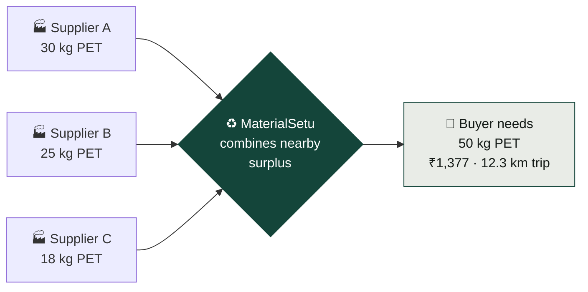
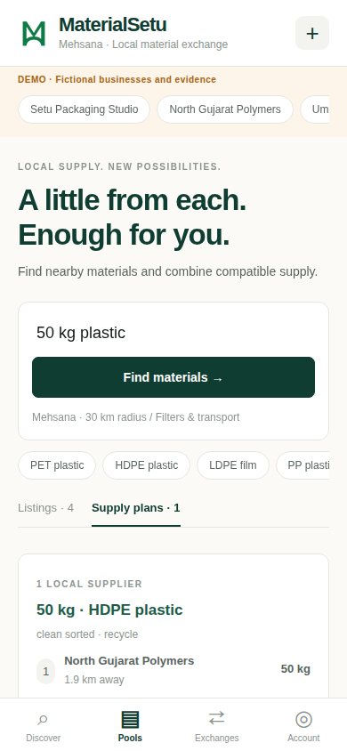
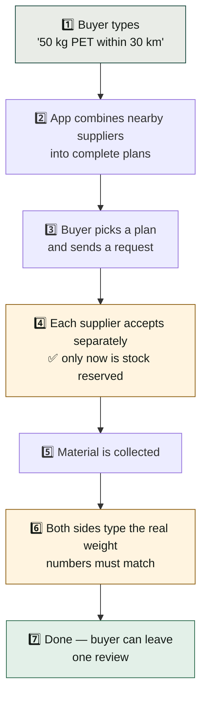
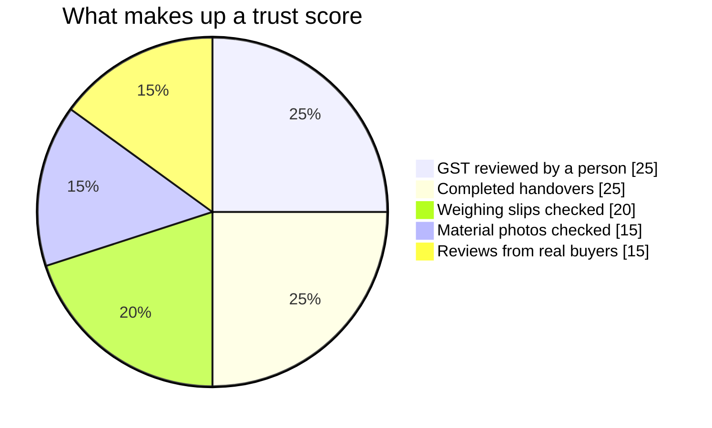
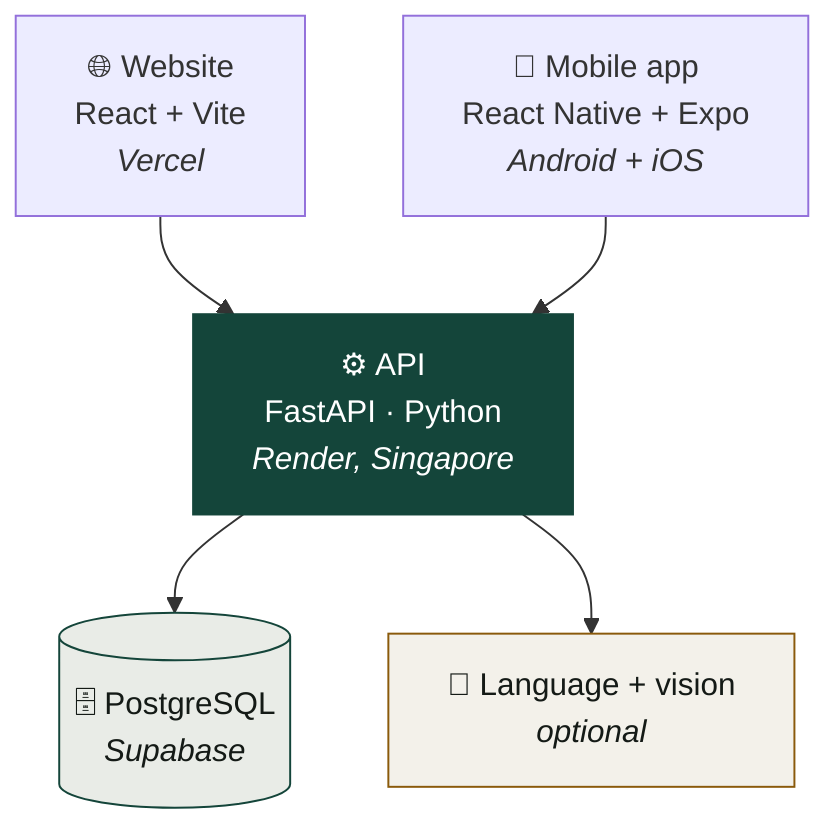

<div align="center">

# ♻️ MaterialSetu

### The local exchange for surplus packaging material

**One factory throws away what the factory next door is buying. MaterialSetu helps them find each other.**

[](https://material-setu-for-hack-out-26-web.vercel.app/)
[](#-try-it-now)
[](#-try-it-now)


**HackOut'26 · Team Tech Titans · Ganpat University**

</div>

---

## 🚀 Try it now

| | Link | Notes |
| :-- | :-- | :-- |
| 🌐 **Website** | **[material-setu-for-hack-out-26-web.vercel.app](https://material-setu-for-hack-out-26-web.vercel.app/)** | Works on phone and laptop. Nothing to install. |
| 🤖 **Android** | **[Download the APK](https://expo.dev/artifacts/eas/UUn2ivp5nFhgSdYC8ZpM7uh2oKTt9buEOXosXty9wwc.apk)** | Open on your phone and tap install. Allow "unknown sources". |
| 🍎 **iOS** | [Simulator build](https://expo.dev/artifacts/eas/EHbcWS-7-LR0ZYtychLx4EAmJeA-a67DYmoR8ArQM1E.tar.gz) | Runs in Xcode's iOS Simulator. An iPhone build needs a paid Apple Developer account — that part is still pending. |

> ⏳ **First load takes up to a minute.** The server sleeps when nobody is using it, so the app shows a "Waking the server…" screen while it starts. Everything after that is instant.
>
> 👤 **No signup needed.** Pick any business from the **"Explore as"** menu at the top to log in.

---

## 🤔 The problem

A packaging factory in Mehsana has 30 kg of leftover PET. It goes to waste.

A buyer 2 km away needs 50 kg of PET. They buy it new.

Neither knows the other exists. And even if they did, two questions stop the deal:

1. **"30 kg isn't enough for me."** Small leftovers are too small to be worth a trip.
2. **"Can I trust this seller?"** No history, no proof, no recourse.

## 💡 Our answer



**Two ideas, together:**

- 🧩 **Pooling** — add up small leftovers from suppliers who are near each other until the buyer has enough.
- 🛡️ **Evidence-based trust** — every supplier gets a score out of 100, built only from things a human has checked.

---

## 📸 What it looks like

<div align="center">

### Search and supply plans
*Type what you need in plain words. Get real listings, plus combined plans that meet your quantity.*


</div>

<table>
<tr>
<td width="50%" valign="top">

### 🛡️ Trust, explained
Every point is shown and where it came from.


</td>
<td width="50%" valign="top">

### 🤝 Exchanges
Both sides confirm what actually changed hands.


</td>
</tr>
<tr>
<td valign="top">

### 📱 On a phone
Same site, fully responsive.


</td>
<td valign="top">

### 📲 The mobile app
Discover and Pools tabs in the React Native app.



</td>
</tr>
</table>

---

## 🔄 How a deal works



**The two steps in orange are the ones that make it honest:**

- Sending a request reserves **nothing**. Stock is only held when a supplier actually agrees.
- If the buyer says 28 kg and the supplier says 25 kg, the app **refuses both** and either side can report a problem for a reviewer to settle.

---

## 👥 Who uses it

| Role | Who they are | What they do |
| :-- | :-- | :-- |
| 🛒 **Buyer** | A business that needs material | Search, compare plans, request, confirm, review |
| 🏭 **Supplier** | A business with surplus | List material, upload proof, accept, confirm |
| 🛡️ **Reviewer** | MaterialSetu staff | Check GST and documents, settle disputes |

**Trying it out?** Pick these from the **"Explore as"** menu to see each side:

| Pick this account | You become |
| :-- | :-- |
| **Setu Packaging Studio** | the 🛒 buyer — start here |
| **North Gujarat Polymers** or **Umiya Packaging Works** | a 🏭 supplier — accept the buyer's request |
| **MaterialSetu Reviewer** | the 🛡️ reviewer — a "Review centre" tab appears |

Switching accounts is how you play both sides of one deal. There are no passwords in demo mode.

Nobody can make themselves a reviewer. Signing up always creates a normal business account; the reviewer role is given from the database by an operator.

---

## 🛡️ The trust score

A supplier's score is **100 points**, and every point is explained on screen.



| Points | How you earn them |
| :-- | :-- |
| **25** | A reviewer checks your GST document and records what they checked |
| **20** | Weighing slips uploaded and approved, across your listings |
| **15** | Material photos uploaded and approved, across your listings |
| **25** | Confirmed handovers — full marks at 10 |
| **15** | Ratings from buyers, and only from buyers who completed a deal |

**Important:** this measures **evidence**, not quality. A new business scores low because it has no history yet — that is not an accusation, and the app says so.

Nothing counts until a human approves it. Upload a photo and it sits at `pending` worth **zero points** until a reviewer looks at it.

---

## ✨ What the app can do

<table>
<tr><td width="33%" valign="top">

### 🔍 Search
Type it however you like — *"50 kg PET within 30 km"*. Filter by material, condition, intended use, distance and budget.

</td><td width="33%" valign="top">

### 🧩 Pooling
Combines up to 4 nearby suppliers. **Never mixes** PET with HDPE — different plastics stay separate options.

</td><td width="33%" valign="top">

### 💰 Cost estimate
Material cost plus a transport estimate you can adjust. Shown as an estimate, never as a quote.

</td></tr>
<tr><td valign="top">

### 🌏 Many languages
Ask in Hindi or Gujarati. *"मुझे 20 लकड़ी के पैलेट चाहिए"* → 20 wooden pallets.

</td><td valign="top">

### 📷 Photo suggestions
Photograph your material and the app suggests a category. You always confirm it yourself.

</td><td valign="top">

### 📄 Proof you control
Photos are public. Weighing slips and GST documents are private to you and the reviewer.

</td></tr>
</table>

---

## 🏗️ How it is built



All the rules live in the API, so the website and the app cannot get different answers or bypass each other's checks.

| Layer | Built with |
| :-- | :-- |
| Website | React 19, Vite, TypeScript |
| Mobile | React Native 0.86, Expo SDK 57 |
| API | FastAPI, SQLAlchemy 2, Python 3.13 |
| Database | PostgreSQL 17 (SQLite for local development) |
| Shared | One TypeScript package for API types and helpers |

**Security basics:** passwords are hashed with PBKDF2 (200,000 rounds), session tokens are stored only as hashes, and application tables live in a private database schema that the public API key cannot reach.

---

## 💻 Run it on your machine

You need **Node.js 22+**, **Python 3.11+** and npm.

```bash
python3 -m venv .venv
source .venv/bin/activate
python -m pip install -r services/api/requirements.txt
npm ci
python scripts/dev.py
```

Then open **http://localhost:5173**. API docs are at **http://localhost:8000/docs**.

That starts with demo data already loaded. Pick an account from the menu at the top — no passwords needed.

<details>
<summary><b>Run the mobile app</b></summary>

```bash
cd apps/mobile
npm ci
npx expo start --go
```

For a real phone, set `EXPO_PUBLIC_API_URL` to your computer's LAN address in `apps/mobile/.env`, then restart Expo. Add `--clear` when you change it, or Expo keeps the old value cached.

</details>

<details>
<summary><b>Build the Android APK</b></summary>

```bash
cd apps/mobile
npx eas-cli login
npx eas-cli build --platform android --profile preview
```

The API address is already pinned in `eas.json`, so the APK works on any phone with internet.

</details>

<details>
<summary><b>Check everything still works</b></summary>

```bash
cd services/api && python -m pytest -q      # 17 API tests
npm run build                               # website type check and build
cd apps/mobile && npm run typecheck         # mobile type check
node scripts/browser-smoke.cjs              # real browser, end to end
```

</details>

<details>
<summary><b>Turn on the language and photo features locally</b></summary>

They are optional. Without a key the app uses keyword rules and everything else
works normally.

```bash
export OPENAI_API_KEY=sk-...     # server-side only, never in the website or app
python scripts/dev.py
```

Check it took effect: `http://localhost:8000/api/health` should report
`"classification": "model"`.

</details>

---

## 📁 Where things are

```text
apps/web/          the website — React + Vite
apps/mobile/       the Android and iOS app — React Native + Expo
packages/shared/   API types and helpers both clients use
services/api/      the whole backend
  ├── main.py      every endpoint
  ├── domain.py    matching, pooling and cost rules — no framework, easy to read
  ├── models.py    the database tables
  ├── ai.py        optional language and photo suggestions
  └── test_api.py  the 17 tests
docs/              architecture, demo script, validation notes
```

If you only read one file, read **`services/api/domain.py`** — the pooling and
cost logic is all there in plain Python.

---

## ☁️ How it is deployed

| Piece | Where | Set up with |
| :-- | :-- | :-- |
| Website | Vercel | `vercel.json` |
| API | Render (Singapore) | `render.yaml` |
| Database | Supabase (PostgreSQL) | `DATABASE_URL` + `DB_SCHEMA=app` |
| Android app | EAS Build | `apps/mobile/eas.json` |

The API needs `DATABASE_URL`, `DB_SCHEMA`, `CORS_ORIGINS` and optionally
`OPENAI_API_KEY`. The website needs only `VITE_API_URL`. Every one of them is
explained in [.env.example](.env.example).

**Why `DB_SCHEMA` matters:** Supabase publishes the `public` schema over HTTPS to
the browser key that ships inside the website and the app. Putting our tables in a
private `app` schema instead is what keeps password hashes and session tokens out
of reach.

The free API server sleeps after 15 minutes of quiet, so
[a scheduled job](.github/workflows/keep-warm.yml) pings it to keep the first
visit fast.

---

## ✅ What is real, and what is not

We would rather be trusted than impressive.

| ✅ Really works | ❌ Not built yet |
| :-- | :-- |
| Accounts, listings, search, filters | Payments of any kind |
| Pooling across nearby suppliers | Live GST registry lookup |
| Trust scores from checked evidence | Real transport quotes or booking |
| Reserve, cancel, partial handover, disputes | Chat between businesses |
| Document upload and human review | Delivery tracking |
| Android app, website | iPhone build (needs a paid Apple account) |

**Three things worth saying plainly:**

- 🔎 **GST is checked by a person, not by the government's system.** We check the number's format, then a reviewer looks at the document and records what they checked. Our own API says so: `"gst_verification": "manual_review"`.
- 🚚 **Transport cost is an estimate.** Straight-line distance × 1.3, with a rate you can edit. Always get a real quote before collecting.
- 🧠 **The AI only suggests.** It helps read a request in another language and suggests a category from a photo. Everything it returns is checked against our material list, and a person confirms it. It never changes a trust score, approves a GST number, or touches stock.

---

## 📚 More detail

| Document | What's in it |
| :-- | :-- |
| [docs/architecture.md](docs/architecture.md) | Scoring formula, state machine, pooling rules, data model |
| [docs/demo.md](docs/demo.md) | Five-minute walkthrough to present |
| [docs/validation.md](docs/validation.md) | What we tested, and the limits of those tests |

---

<div align="center">

## 👨‍💻 Team Tech Titans

**Dhruvil Prajapati · Yovan Sanghvi · Vishwa Patel · Mittal Prajapati**

Department of Computer Science, Ganpat University

*Good materials deserve another beginning.*

</div>
