<div align="center">


# MaterialSetu

### The local exchange for surplus packaging material

**One factory throws away what the factory next door is buying. MaterialSetu helps them find each other.**

[](https://material-setu-for-hack-out-26-web.vercel.app/)
[](https://drive.google.com/drive/folders/1xcZ9f50orPHMnsKcwi9gxry784bJQfay?usp=sharing)
[](#-iphone)


**HackOut'26 · Team Tech Titans · Ganpat University**

</div>

---

## 🚀 Try it now

| | Link | Notes |
| :-- | :-- | :-- |
| 🌐 **Website** | **[material-setu-for-hack-out-26-web.vercel.app](https://material-setu-for-hack-out-26-web.vercel.app/)** | Works on phone and laptop. Nothing to install. |
| 🤖 **Android** | **[Download the APK (Google Drive)](https://drive.google.com/drive/folders/1xcZ9f50orPHMnsKcwi9gxry784bJQfay?usp=sharing)** | Download on the phone, tap it, allow "install unknown apps". Also on [Expo](https://expo.dev/accounts/dhruvil1309/projects/materialsetu/builds/123cbea2-0d8d-47ed-b802-db6d6a249725). |
| 🍎 **iPhone** | [Run in Expo Go](#-iphone) | Free, through the Expo Go app. A standalone iPhone install needs a paid Apple Developer account. |
| 🎬 **Demo video** | [Two-minute walkthrough](docs/demo-video.mp4) | Recorded end to end on a test database. Voiceover scripts in [docs/demo-script.md](docs/demo-script.md). |

### 🔑 Signing in

| To see | Do this |
| :-- | :-- |
| 🛡️ **The admin panel** | Sign in with **`admin`** / **`admin`** |
| 🏭 **The generator panel** | **Create account** → choose **"We generate surplus"** |
| 🚛 **The collector panel** | **Create account** → choose **"We collect material"** |

> ⏳ **The first load can take up to a minute.** The free server sleeps when idle, and the app shows a "waking the exchange" screen while it starts. Everything after that is quick.
>
> ✅ **The live site holds only real records.** There are no sample businesses on it. If a search comes back empty, nobody nearby has listed that material yet.

---

## 🤔 The problem

A packaging unit in Mehsana has 30 kg of leftover PET. It gets thrown away.

A recycler 2 km away needs 50 kg of PET. They buy it new.

Neither knows the other exists. Even if they did, two things stop the deal:

1. **"30 kg isn't enough for me."** Small leftovers aren't worth a trip on their own.
2. **"Can I trust this business?"** No history, no proof, no one who checked.

## 💡 Our answer

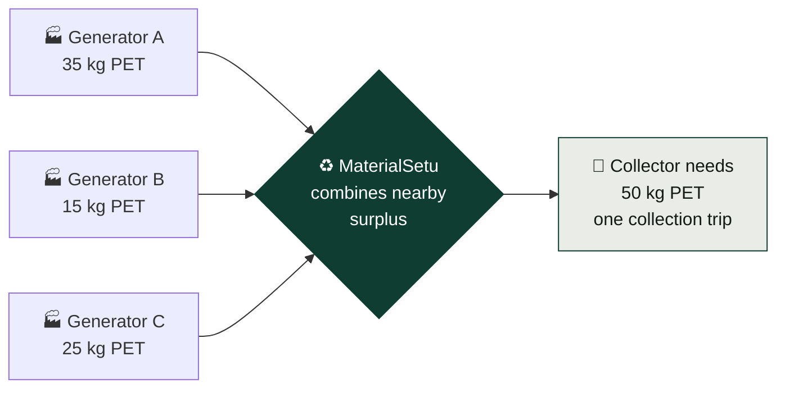

**Two ideas, working together:**

- 🧩 **Pooling** — add up small leftovers from generators who are close to each other until the collector has enough.
- 🛡️ **Evidence-based trust** — every business gets a score out of 100, built only from things a person has checked.

---

## 👥 Three roles, three panels

Every account chooses what it came to do when it signs up. **Each panel shows only the work that role does — nothing else.**

<div align="center">
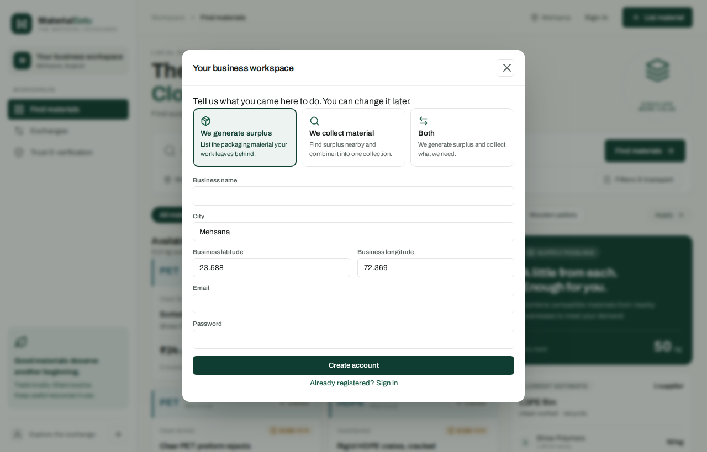
</div>

| Role | Who they are | Website panel | Android / iPhone tabs |
| :-- | :-- | :-- | :-- |
| 🏭 **Generator** | A business whose work leaves surplus packaging | My listings · Requests · Trust & verification | Requests · Supply · Account |
| 🚛 **Collector** | A business that collects and uses that material | Find materials · Exchanges · Trust & verification | Discover · Pools · Exchanges · Account |
| 🔁 **Both** | A business that does both | All of the above | All of the above |
| 🛡️ **Admin** | MaterialSetu reviewer | **Review centre only** | **Review · Account** |

**The rules are enforced by the API, not just hidden in the interface:**

- A collector-only account **cannot list material**. A generator-only account **cannot send collection requests**. Both get a clear message saying which setting to change.
- A business can switch between Generator, Collector and Both from its account page at any time.
- **Nobody can make themselves admin.** It isn't offered at signup. Admin accounts are created by the operator with `services/api/set_admin.py`.
- An admin **never trades** and **cannot approve its own GST or documents**.

---

## 📸 What each panel looks like

<div align="center">

### 🚛 Collector — search and supply plans
*Type what you need in plain words. Get nearby listings, plus combined plans that add up to your quantity.*

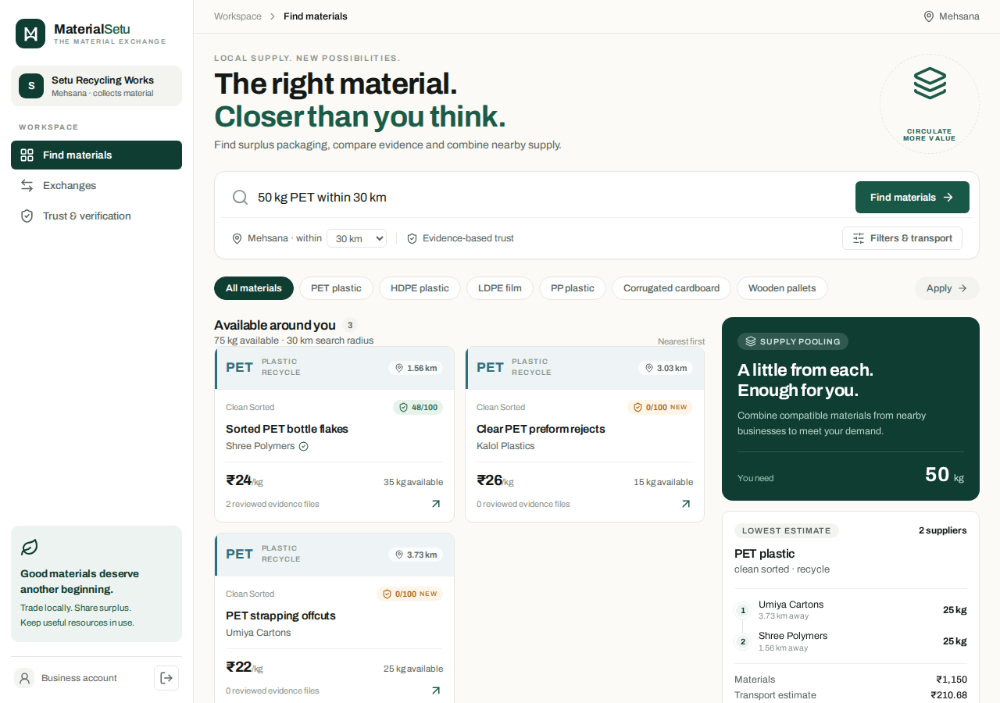

</div>

<table>
<tr>
<td width="50%" valign="top">

### 🛡️ Trust, explained
Every point shows where it came from.

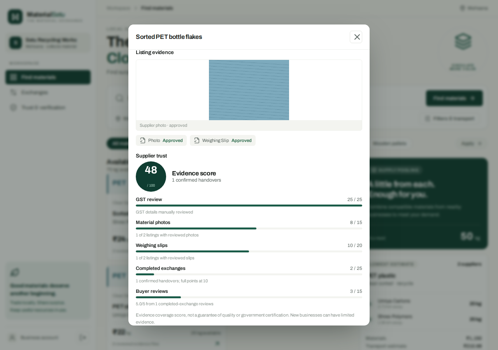

</td>
<td width="50%" valign="top">

### 🤝 Exchanges
Each generator accepts separately. Both sides confirm what changed hands.

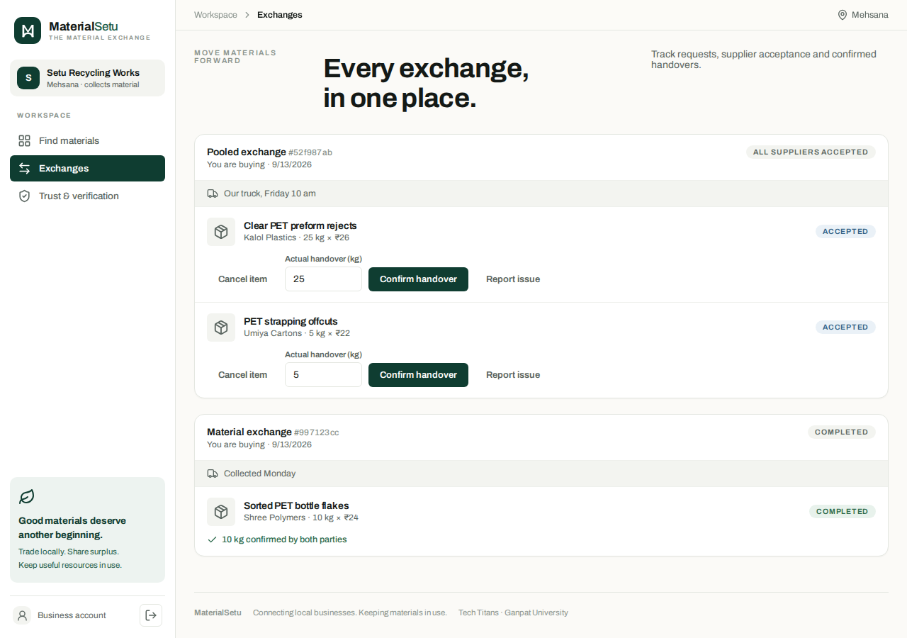

</td>
</tr>
<tr>
<td valign="top">

### 🏭 Generator — my listings
Only their own supply. No search, nothing to buy.

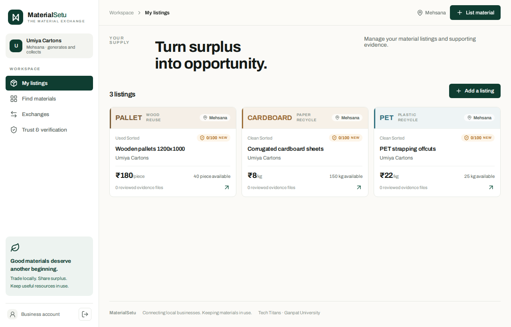

</td>
<td valign="top">

### 🛡️ Admin — review centre
The GST queue, documents, disputes and every business, with full GST management.

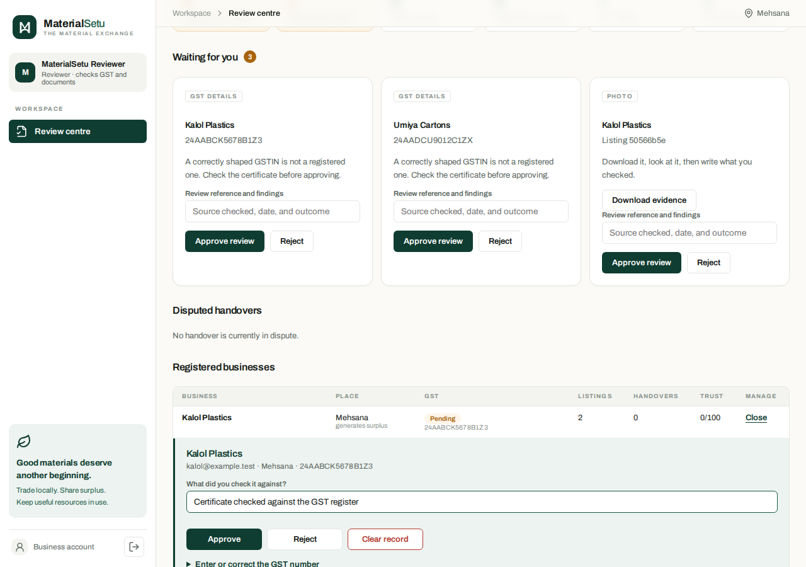

</td>
</tr>
</table>

<table>
<tr>
<td align="center" valign="top">

**Website on a phone**

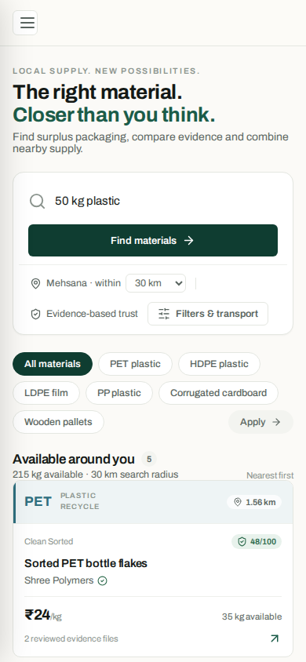

</td>
<td align="center" valign="top">

**App · Discover**

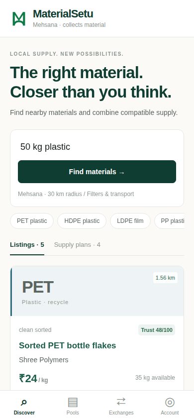

</td>
<td align="center" valign="top">

**App · Pools**

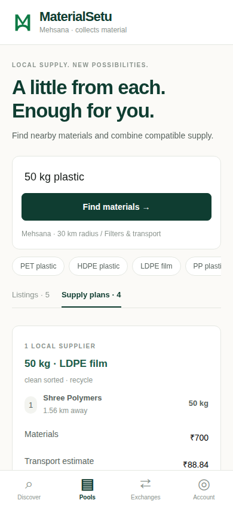

</td>
<td align="center" valign="top">

**App · Admin review**

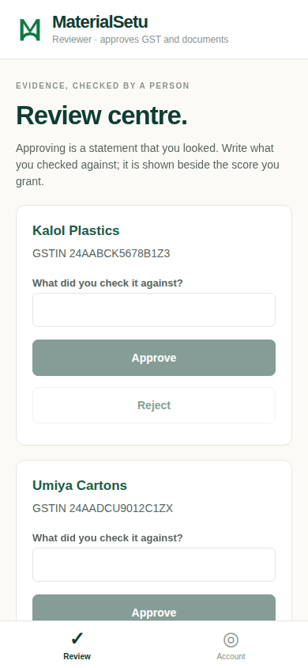

</td>
</tr>
</table>

<sub>Screenshots are taken by <code>scripts/capture-screenshots.cjs</code> on a throwaway local database, with demo mode off — the same way the live site runs. The businesses in them are test accounts.</sub>

---

## 🔄 How a deal works

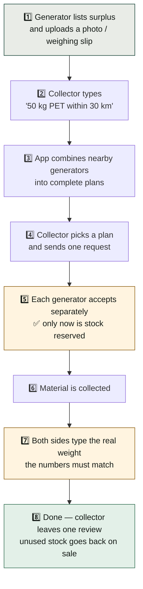

**The two orange steps are what keep it honest:**

- Sending a request reserves **nothing**. Stock is held only when a generator actually agrees.
- If the collector says 28 kg and the generator says 25 kg, the app **accepts neither**, and either side can report the problem for the admin to settle.

---

## 🧾 GST verification

GST is checked by a **person**, never assumed from a correctly shaped number.

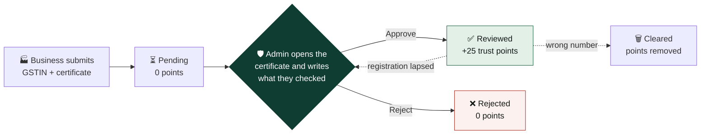

The admin panel's **Registered businesses** table gives full control over every GST record:

| Action | What it does |
| :-- | :-- |
| 👁️ **View** | Every business — email, city, role, GSTIN, status, last reviewer note, listings, handovers, trust score |
| ➕ **Enter / correct** | Type in or fix a GSTIN for a business (a typo, or a number given by phone). It goes back to **pending** — entering a number is not checking it |
| ✅ **Approve / reject** | Record a decision. A decision already made can be **revisited** |
| 🗑️ **Clear** | Remove the record entirely. **The 25 points it earned go with it** |

**Every action needs a written reason**, and the reason is shown next to the score it gives. The same queue is on the Android and iPhone app under the **Review** tab.

---

## 🛡️ The trust score

A business's score is **out of 100**, and every point is explained on screen.

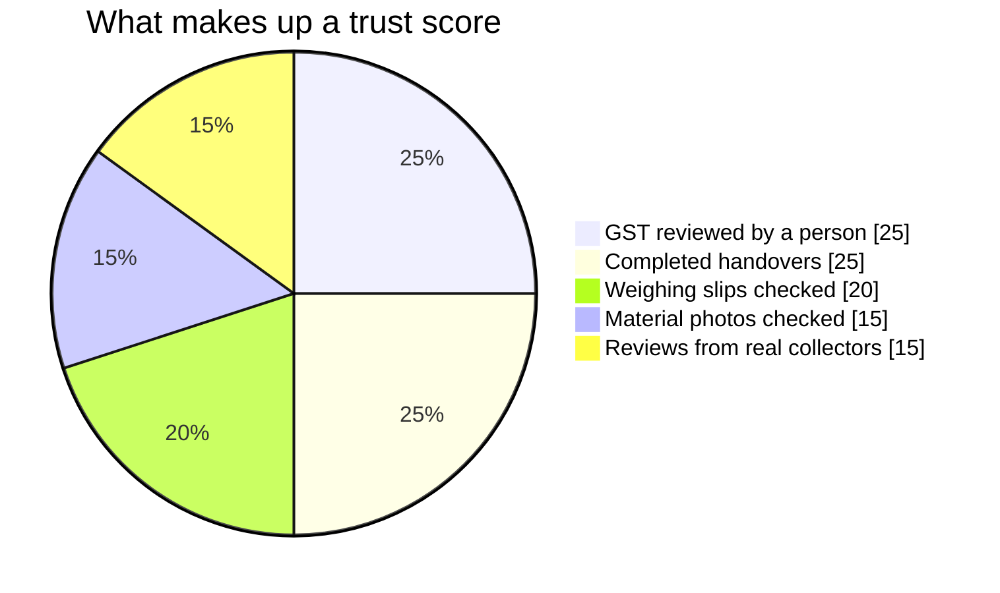

| Points | How they are earned |
| :-- | :-- |
| **25** | The admin checks the GST certificate and records what they checked |
| **20** | Weighing slips uploaded and approved, across the business's listings |
| **15** | Material photos uploaded and approved, across the business's listings |
| **25** | Handovers confirmed by both sides — full marks at 10 |
| **15** | Ratings, only from collectors who completed a deal with them |

**This measures evidence, not honesty.** A new business scores low because it has no history yet — the app says so on screen.

Nothing counts until a person approves it. An uploaded photo sits at **pending, worth zero**, until the admin looks at it.

---

## ✨ What it can do

<table>
<tr><td width="33%" valign="top">

### 🔍 Search
Type it however you like — *"50 kg PET within 30 km"*. Filter by material, condition, reuse or recycle, distance and budget.

</td><td width="33%" valign="top">

### 🧩 Pooling
Combines up to 4 nearby generators, who must also be near **each other**. **Never mixes** PET with HDPE.

</td><td width="33%" valign="top">

### 💰 Cost estimate
Material cost plus an editable transport estimate. Always shown as an estimate, never a quote.

</td></tr>
<tr><td valign="top">

### 🌏 Your language
Ask in Hindi or Gujarati. *"मुझे 20 लकड़ी के पैलेट चाहिए"* → 20 wooden pallets.

</td><td valign="top">

### 📷 Photo suggestions
Photograph the material and the app suggests a category. The generator always confirms it.

</td><td valign="top">

### 📄 Private documents
Photos are public. Weighing slips and GST certificates are visible only to the business and the admin. Files are stored in a private bucket.

</td></tr>
</table>

---

## 🏗️ How it is built

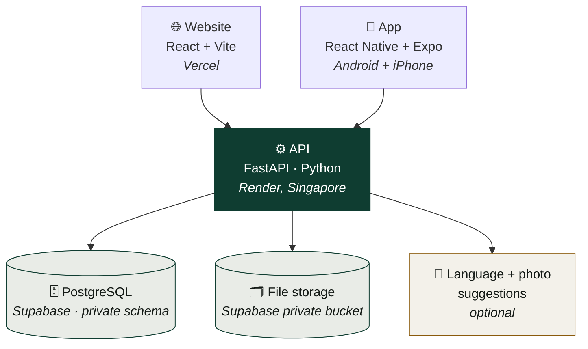

**Every rule lives in the API** — roles, reservations, trust points, GST decisions. The website and the app can't disagree or skip each other's checks.

| Layer | Built with |
| :-- | :-- |
| Website | React 19, Vite, TypeScript |
| App | React Native 0.86, Expo SDK 57 |
| API | FastAPI, SQLAlchemy 2, Python 3.13 |
| Database | PostgreSQL 17 on Supabase (SQLite for local development) |
| Files | Supabase Storage, private bucket, served only through the API |
| Shared | One TypeScript package for API types and helpers |

**Security basics:** passwords hashed with PBKDF2 (200,000 rounds) · session tokens stored only as hashes · tables in a private `app` schema the public Supabase key cannot reach · uploaded images re-encoded to strip metadata · 5 MB upload limit.

---

## 📱 Install the app

### 🤖 Android

1. Open the **[Google Drive folder](https://drive.google.com/drive/folders/1xcZ9f50orPHMnsKcwi9gxry784bJQfay?usp=sharing)** on the phone and download the APK.
2. Tap the file. If Android says *"not allowed to install unknown apps"*, tap **Settings → Allow from this source**, then go back.
3. Tap **Install**. An older MaterialSetu updates in place.

### 🍎 iPhone

Apple doesn't allow installing an app from a link without a paid Developer account, so the iPhone version runs inside **Expo Go**:

1. Install **Expo Go** from the App Store.
2. On a computer with this repository, start the app with a tunnel:

   ```bash
   cd apps/mobile
   npm ci
   EXPO_PUBLIC_API_URL="https://materialsetu-for-hackout-26.onrender.com/api" npx expo start --tunnel
   ```

3. Scan the QR code it prints with the iPhone **Camera** app. It opens in Expo Go.

The tunnel means the phone does **not** need to be on the same Wi-Fi. Keep the terminal open while using it.

---

## 💻 Run it on your machine

You need **Node.js 22+**, **Python 3.11+** and npm.

```bash
python3 -m venv .venv
source .venv/bin/activate
python -m pip install -r services/api/requirements.txt
npm ci
python scripts/dev.py
```

Open **http://localhost:5173**. API docs are at **http://localhost:8000/docs**.

Locally, `scripts/dev.py` turns on **demo mode**: a set of clearly fictional businesses and an **"Explore as"** menu to switch between them without passwords. The live site never runs in demo mode.

<details>
<summary><b>Run the mobile app locally</b></summary>

```bash
cd apps/mobile
npm ci
npx expo start --tunnel
```

For the app to reach your local API, set `EXPO_PUBLIC_API_URL` to a URL the phone can reach, and add `--clear` whenever you change it — Expo caches the old value.

</details>

<details>
<summary><b>Build the Android APK</b></summary>

```bash
cd apps/mobile
npx eas-cli login
npx eas-cli build --platform android --profile preview
```

The live API address is pinned in `eas.json`, so the APK works on any phone with internet.

</details>

<details>
<summary><b>Check everything still works</b></summary>

```bash
python scripts/uat.py                        # 96 acceptance checks, in plain English
cd services/api && python -m pytest -q      # 19 API tests
npm run build                               # website type check and build
cd apps/mobile && npm run typecheck         # app type check
node scripts/browser-smoke.cjs              # real browser, website and app, end to end
node scripts/capture-screenshots.cjs        # regenerate the README screenshots
```

</details>

<details>
<summary><b>Turn on the language and photo features</b></summary>

Optional. Without a key the app uses keyword rules and everything else works the same.

```bash
export OPENAI_API_KEY=sk-...     # server-side only, never in the website or app
python scripts/dev.py
```

`http://localhost:8000/api/health` should then report `"classification": "model"`.

</details>

---

## 🛠️ Operator commands

Run these by hand against a database you control. They are deliberately **not** reachable through the website or app. Against Supabase, always set `DB_SCHEMA=app`.

```bash
cd services/api
export DATABASE_URL="postgresql+psycopg://..."   # the same value Render uses
```

| Command | What it does |
| :-- | :-- |
| `DB_SCHEMA=app python set_admin.py admin admin` | Create an admin account, or change its password. Leave the password out to be prompted without echo |
| `DB_SCHEMA=app python create_reviewer.py someone@example.com` | Give admin access to an account that already signed up |
| `python ../../scripts/clean_demo.py --dry-run` | Add any missing columns and count demo records. Drop `--dry-run` to delete them |
| `python ../../scripts/drop_public_tables.py` | Remove empty tables accidentally created in the public schema |

---

## 📁 Where things are

```text
apps/web/            the website — React + Vite
apps/mobile/         the Android and iPhone app — React Native + Expo
packages/shared/     API types and helpers both clients use
services/api/        the whole backend
  ├── main.py        every endpoint, including roles and GST management
  ├── domain.py      matching, pooling and cost rules — plain Python
  ├── models.py      the database tables
  ├── storage.py     private file storage
  ├── ai.py          optional language and photo suggestions
  ├── set_admin.py   create or update an admin account
  └── test_api.py    the 19 tests
scripts/             dev runner, acceptance checks, browser tests, operator scripts
docs/                architecture, walkthrough, validation, screenshots, demo video
```

If you only read one file, read **`services/api/domain.py`** — the pooling and cost logic is all there.

---

## ☁️ How it is deployed

| Piece | Where | Set up with |
| :-- | :-- | :-- |
| Website | Vercel | `vercel.json` |
| API | Render (Singapore) | `render.yaml` |
| Database + files | Supabase (PostgreSQL + Storage) | `DATABASE_URL`, `DB_SCHEMA=app`, `SUPABASE_URL`, `SUPABASE_SERVICE_KEY` |
| Android app | EAS Build | `apps/mobile/eas.json` |

The API needs `DATABASE_URL`, `DB_SCHEMA`, `CORS_ORIGINS`, `DEMO_MODE=0`, the Supabase storage pair, and optionally `OPENAI_API_KEY`. The website needs only `VITE_API_URL`. Every one is explained in [.env.example](.env.example).

**Why `DB_SCHEMA` matters:** Supabase publishes the `public` schema over HTTPS to the key that ships inside the website and app. Keeping our tables in a private `app` schema is what keeps password hashes and session tokens out of reach.

The free API server sleeps after 15 minutes of quiet, so [a scheduled job](.github/workflows/keep-warm.yml) pings it to keep the first visit fast.

---

## ✅ What is real, and what is not

We would rather be trusted than impressive.

| ✅ Really works | ❌ Not built yet |
| :-- | :-- |
| Generator, collector and admin roles, enforced by the API | Payments of any kind |
| Listings, search, filters, pooling across nearby generators | Live lookup against the government GST registry |
| Trust scores built only from checked evidence | Real transport quotes or booking |
| Reserve, cancel, partial handover, disputes | Chat between businesses |
| GST and document review, with full GST management | Password reset by email |
| Website, Android app, iPhone via Expo Go | Standalone iPhone install (needs a paid Apple account) |

**Three things worth saying plainly:**

- 🔎 **GST is checked by a person, not the government's system.** We check the number's format; the admin looks at the certificate and records what they checked. The API says so itself: `"gst_verification": "manual_review"`.
- 🚚 **Transport cost is an estimate.** Straight-line distance × 1.3 with a rate you can change. Get a real quote before collecting.
- 🧠 **The AI only suggests.** It reads requests in other languages and suggests a category from a photo. Every answer is checked against our material list, and a person confirms it. It never changes a trust score, approves GST, or touches stock.

---

## 📚 More detail

| Document | What's in it |
| :-- | :-- |
| [docs/architecture.md](docs/architecture.md) | Roles, scoring formula, exchange states, pooling rules, data model |
| [docs/demo.md](docs/demo.md) | Walkthrough to present, role by role |
| [docs/validation.md](docs/validation.md) | What we tested, and the limits of those tests |
| [docs/demo-script.md](docs/demo-script.md) | Demo video voiceover, in English and Hindi |

---

<div align="center">

## 👨‍💻 Team Tech Titans

**Dhruvil Prajapati · Yovan Sanghvi · Vishwa Patel · Mittal Prajapati**

Department of Computer Science, Ganpat University

*Good materials deserve another beginning.*

</div>
