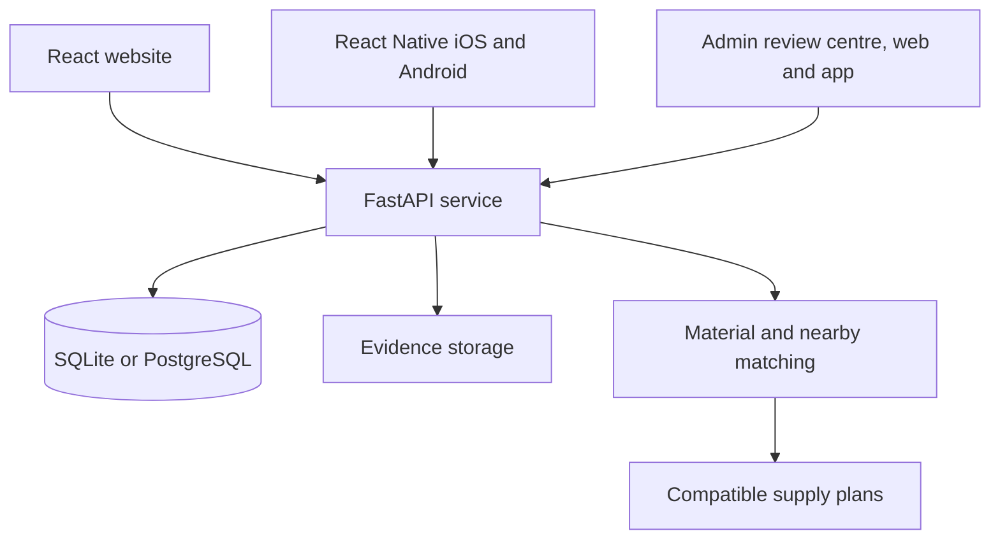
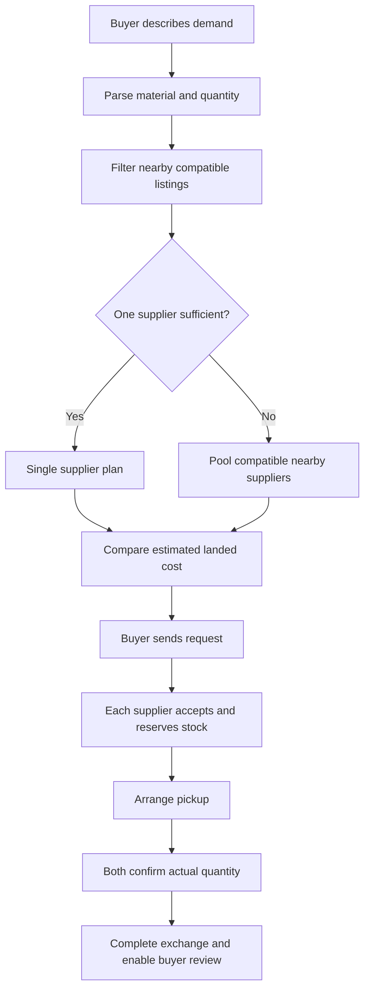
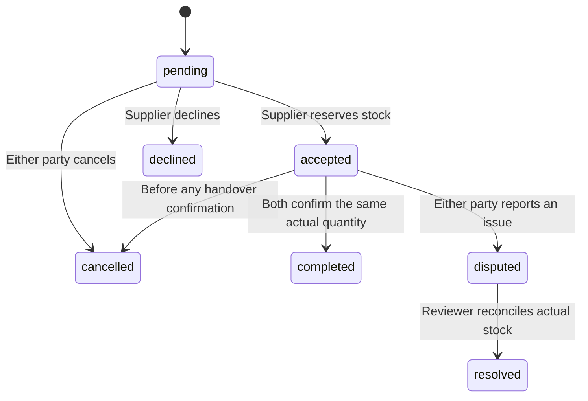

# How MaterialSetu works

## One exchange, three clients



The TypeScript clients share the API contract, formatting and request helper. Business rules are enforced on the server so the mobile and website flows cannot bypass each other's inventory or permission checks. Bearer session tokens are opaque; only token hashes are stored in the database. Passwords are PBKDF2 salted hashes. Sessions expire after seven days.

## Roles

Every business account declares what it came to do, at registration, and can change it later from its account page. The choice is enforced by the API, and each client shows only the navigation that role can use.

| Role | `kind` / `role` | Can | Cannot |
| --- | --- | --- | --- |
| Generator | `kind=supplier` | List material, upload evidence, accept and confirm handovers, submit GST | Send collection requests (403) |
| Collector | `kind=buyer` | Search, send pooled requests, confirm handovers, review completed deals | List material (403) |
| Both | `kind=both` | Everything a generator and a collector can | — |
| Admin | `role=admin` | Review GST and evidence, manage every GST record, settle disputes, see every business | Trade; decide its own GST or evidence |

`role` is never set through the API. Registration only accepts the three `kind` values; admin accounts are created by the database operator with `services/api/set_admin.py` (new account with password) or `create_reviewer.py` (promote an existing one).

## GST management

| Endpoint | Effect |
| --- | --- |
| `POST /api/me/gst` | A business submits its GSTIN. Structure is checked; status becomes `pending` |
| `GET /api/admin/businesses?status=` | Every business with email, role, GSTIN, status, last note, listings, handovers and score |
| `PUT /api/admin/gst/{id}` | Admin enters or corrects a GSTIN. It lands as `pending`: entering is not checking |
| `POST /api/admin/gst/{id}` | Approve (`reviewed`, +25 points) or reject. A settled decision can be revisited |
| `DELETE /api/admin/gst/{id}` | Clear the record; the points it earned are removed with it |

Every admin action requires a written reference of at least eight characters, stored with the decision. No admin may act on its own business.

## Collector and generator workflow

Code and data use `buyer` for the collector and `seller`/`supplier` for the generator.



A request itself does not reserve stock. Acceptance uses a conditional database update, so concurrent buyers cannot both reserve the same last units. A pooled request has independent items; it is ready only after all suppliers accept. A decline does not automatically find a replacement or release other accepted items: the buyer can cancel remaining items before handover or request a new plan. Partial completion is shown item by item.



Cancellation releases reserved inventory once. A zero-quantity handover cannot complete or earn review points; cancel or dispute it instead. A partial handover releases the unused amount only after both parties agree. Different entered actual quantities return a conflict; parties can report an issue for review. Disputed quantities stay reserved until a reviewer resolves them. A dispute resolution is recorded separately and does not automatically earn completed-transaction trust points or review eligibility. There is no automatic expiry worker in this release.

## A transparent trust score

| Input | Maximum | Current rule |
| --- | ---: | --- |
| GST review | 25 | 25 after a reviewer approves the submitted GSTIN with a reference; otherwise 0 |
| Material photographs | 15 | 15 × fraction of supplier listings with at least one approved photograph |
| Weighing slips | 20 | 20 × fraction of supplier listings with at least one approved slip |
| Completed exchanges | 25 | 25 × minimum(completed handovers / 10, 1) |
| Buyer reviews | 15 | 15 × (average rating − 1) / 4 × minimum(review count / 5, 1) |

Each component is rounded to whole points and then summed. Without reviews, review points are zero. Only one review per completed exchange item is allowed and only its buyer can write it. More than five reviews still affect the average rating, but the confidence multiplier stays at 1. Adding a new listing without evidence can reduce document coverage. No listings means zero photo/slip coverage.

This is a product scoring policy, not a statistically calibrated probability or government rating. A low score can mean a new company with little evidence. It does not prove dishonesty. Business name, document links, component explanations, review count and demo indicators are shown alongside the score. Repeated real-looking exchanges between cooperating accounts could still manipulate history; collusion detection and independent verification remain pilot work.

GSTIN submissions are checked for structure only, put into `pending`, and earn no points until manual review. A GST document approval alone does not approve the GSTIN: these are separate queue actions. Reviewers cannot approve their own evidence. Sample reviewed documents are visibly fictional.

## Nearby pooling and cost

Candidate supply must match **material ID + declared condition + reuse/recycle destination + unit**. Every supplier must fall within the buyer radius, and every supplier pair must also fall within that radius. This prevents pooling suppliers that are individually near the buyer but far apart from each other.

The first release evaluates combinations of up to four listings among the nearest 15 in each compatibility group. It allocates the cheapest material within each candidate combination, visits distinct suppliers with a nearest-neighbour heuristic, and returns the five lowest estimated total-cost plans found. It does not claim a globally optimal route or that it checks every listing combination at scale.

```text
Estimated route distance = straight-line round trip × 1.3
Transport estimate = route distance × entered ₹/km + supplier stops × entered loading fee
Material cost = sum of allocated quantity × listing unit price
Estimated landed cost = material cost + transport estimate
```

Default assumptions are ₹12/km and ₹40 per supplier stop, chosen for the demo rather than as market rates. The buyer can edit them and set maximum transport or landed cost per unit. Distance filters use straight-line distance; the 1.3 road multiplier is only an approximation. Taxes, vehicle capacity, tolls, handling restrictions and live traffic are not modelled. Buyers must obtain a real quote before pickup.

Listings may have weight quantities with up to practical kilogram precision; pallets use whole pieces. A compatible plan does not certify material purity, food-contact suitability, pallet strength or end-use approval. The seller describes the material and the buyer checks processor requirements.

## Search, classification and future AI

The working baseline recognizes material aliases, quantity with units and an optional `within N km` phrase. Generic “plastic” searches PET, HDPE, LDPE and PP as separate compatible groups. Potential-use descriptions help discovery. Unknown phrases request clarification rather than fabricating a category. The listing form can suggest categories from a description, which the seller confirms.

**An optional model adapter is connected** in `services/api/ai.py`, enabled by `OPENAI_API_KEY`. It sits on the API side, before matching, and follows the constraints this document set for it.

The keyword rules run first and answer every ordinary search on their own, so the usual path costs nothing and stays instant. Only a phrase the rules cannot read — another language, an unusual wording — reaches the model, and only for a signed-in member. A seller can also photograph material for suggested categories.

Every reply is validated back to the taxonomy before use: unknown material IDs are dropped, quantities outside the accepted range are discarded, and pallets must still be whole pieces. The model never changes a trust score, verifies a GSTIN or reserves inventory, and the category published on a listing is the one the seller selects. For photographs it returns candidates with a confidence level and names what the seller must confirm, because a photograph cannot identify a polymer. If the key is absent, the request fails or the provider is slow, every caller falls back to the keyword rules and the application behaves exactly as it did before.

## Data and access

| Entity | Purpose |
| --- | --- |
| Business | Account, registered coordinates, GST review state, `role` and `kind` |
| LoginSession | Hashed bearer token and expiry |
| Listing | Declared material, condition, price and available stock |
| Evidence | Ownership, optional listing link, file and reviewer decision |
| Exchange | Buyer, pickup text, request idempotency key and pooled flag |
| ExchangeItem | Seller allocation, reservation status and handover confirmations |
| Review | Eligible buyer's rating and comment for one completed item |

Photos are public listing evidence. GST documents and weighing slips require the owner or reviewer token to download; other buyers see review status only. Images are decoded, resized and rewritten to remove metadata. Files have a 5 MB upload limit. PDF validation checks the file signature; deeper malware scanning is not implemented. Files are not served from a public static directory.

The database operator controls admin accounts. An exchange seller only receives their own items, while the buyer can inspect the complete pool. Registration cannot create an admin. The live deployment runs with `DEMO_MODE=0`: no fictional records are seeded and the passwordless demo login is disabled. Requests have idempotency keys: retrying the same allocation returns the same exchange; reusing a key for different items is rejected.
